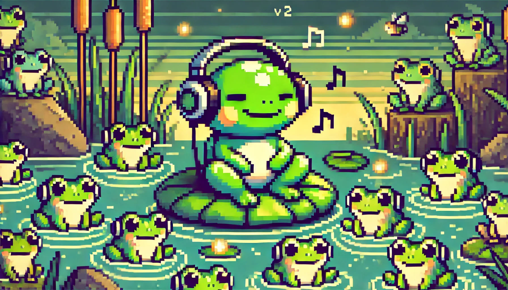

# DJ Toad v2.1 🎧🐸



DJ Toad es un bot de Discord diseñado para llevar la mejor música y diversión a tu servidor. Ahora con una estructura modular mejorada y nuevos juegos interactivos, es más fácil de mantener, escalar y contribuir. Permite a los usuarios buscar canciones, gestionar la reproducción, disfrutar de divertidos comandos adicionales y participar en un emocionante **Trivial Musical** mejorado en su v2 para mayor consistencia y manejo de errores. Se incluyen comandos de depuración y manejo del servidor del bot.

## Índice

1. [Características](#características)
2. [Comandos Disponibles](#comandos-disponibles)
3. [Requisitos](#requisitos)
4. [Instalación](#instalación)
5. [Configuración del Bot en Discord](#configuración-del-bot-en-discord)
6. [Uso](#uso)
7. [Estructura del Proyecto](#estructura-del-proyecto)
8. [Notas Importantes](#notas-importantes)
9. [Contribuciones](#contribuciones)
10. [Autor](#autor)
11. [Licencia](#licencia)

## Características

- **Reproducción de Música Mejorada**: Busca y reproduce canciones desde YouTube Music con mayor eficiencia.
- **Trivial Musical**: Un juego interactivo de trivia musical donde los usuarios pueden competir en rondas para adivinar canciones y ganar puntos.
- **Estructura Modular**: Código organizado en módulos para facilitar la administración y expansión del bot.
- **Cola de Reproducción Dinámica**: Gestiona colas de canciones por servidor, permite añadir nuevas canciones y muestra la cola actual.
- **Control de Reproducción**: Pausa, reanuda, salta canciones y detiene la reproducción con comandos simples.
- **Recomendaciones Automáticas**: Añade automáticamente canciones recomendadas a la cola para una experiencia musical ininterrumpida.
- **Comandos Divertidos**: Añade diversión al chat con comandos que envían GIFs y mensajes animados.
- **Comandos Administrativos**: Reinicia o apaga el servidor del bot con permisos administrativos.

## Comandos Disponibles

- **Comandos de Música**:
  - `!play [canción/artista]`: Busca y reproduce una canción en tu canal de voz.
  - `!add [canción/artista]`: Añade una canción al inicio de la cola de reproducción.
  - `!list`: Muestra la canción actual y la cola de reproducción.
  - `!next`: Salta a la siguiente canción en la cola.
  - `!pause`: Pausa la canción en reproducción.
  - `!resume`: Reanuda la canción pausada.
  - `!stop`: Detiene la música y desconecta al bot.

- **Trivial Musical**:
  - `!trivial`: Inicia un juego de trivia musical con 7 rondas. Los jugadores deberán adivinar el título de las canciones basándose en fragmentos reproducidos.
  - `!trivial_stop`: Detiene el trivial en curso.
  - `!leaderboard`: Muestra el leaderboard actual con los puntajes de los jugadores.

- **Comandos Divertidos**:
  - `!dance1`, `!dance2`: ¡Saca a Toad a bailar!

- **Comandos Administrativos**:
  - `!restart_bot`: Reinicia el bot en el servidor (solo administradores).
  - `!shutdown_bot`: Apaga completamente el bot (solo administradores).

- **Trivial Musical**:
  - `!trivial`: Inicia un juego de trivia musical con 7 rondas. Los jugadores deberán adivinar el título de las canciones basándose en fragmentos reproducidos.
  - `!trivial_stop`: Detiene el trivial en curso.
  - `!leaderboard`: Muestra el leaderboard actual con los puntajes de los jugadores.

- **Comandos Divertidos**:
  - `!dance1`, `!dance2`: ¡Saca a Toad a bailar!

## Requisitos

- **Python 3.8 o superior**: Asegúrate de tener una versión compatible de Python instalada.
- **FFmpeg**: Instalado y configurado en las variables de entorno del sistema.
- **Dependencias de Python**: Listadas en `requirements.txt`.
- **Cuenta de Discord y Servidor**: Donde tengas permisos para añadir bots.

## Instalación

1. **Clona el repositorio**:

   ```bash
   git clone https://github.com/kzon94/djtoad-v2.git
   cd djtoad-v2
   ```

2. **Crea un entorno virtual** (opcional pero recomendado):

   ```bash
   python -m venv venv
   source venv/bin/activate   # En Windows: venv\Scripts\activate
   ```

3. **Instala las dependencias**:

   ```bash
   pip install -r requirements.txt
   ```

4. **Configura las variables de entorno**:

   - Crea un archivo `.env` en la raíz del proyecto.
   - Añade tu token de Discord al archivo `.env`:

     ```env
     DISCORD_TOKEN=tu_token_de_discord
     ```

5. **Verifica que `ffmpeg` está instalado**:

   - Asegúrate de que `ffmpeg` está instalado y su ruta está añadida a las variables de entorno del sistema.
   - Puedes comprobarlo ejecutando:

     ```bash
     ffmpeg -version
     ```

6. **Ejecuta el bot**:

   ```bash
   python bot.py
   ```

## Configuración del Bot en Discord

1. **Crea una aplicación y un bot**:

   - Ve al [Portal de Desarrolladores de Discord](https://discord.com/developers/applications).
   - Haz clic en **"New Application"**, dale un nombre y crea el bot en la pestaña **"Bot"**.
   - Activa los **"Intents"** necesarios (Presencia, Miembros y Mensajes si es requerido).

2. **Obtén el token del bot**:

   - En la sección **"Bot"**, copia el **"Token"** y añádelo al archivo `.env` como se indicó anteriormente.

3. **Invita al bot a tu servidor**:

   - En **"OAuth2"** > **"URL Generator"**:
     - En **Scopes**, selecciona `bot`.
     - En **Bot Permissions**, selecciona:
       - **General Permissions**:
         - Read Messages/View Channels
         - Send Messages
       - **Voice Permissions**:
         - Connect
         - Speak
     - Copia y pega el enlace generado en tu navegador para invitar al bot a tu servidor.

## Uso

### Reproducción de Música

1. **Únete a un canal de voz** en tu servidor de Discord.

2. **Interactúa con el bot** usando los comandos de música en un canal de texto.

3. **Disfruta de la música** y controla la reproducción a tu gusto.

### Trivial Musical

1. **Inicia el trivial** con el comando `!trivial`.

2. **Sigue las instrucciones** que el bot te proporcionará en el chat.

   - **Escribe un género musical** para seleccionar el tipo de canciones.
   - **Escucha los fragmentos de canciones** que el bot reproducirá en tu canal de voz.
   - **Responde en el chat** con el título de la canción lo más rápido posible.

3. **Compite con otros jugadores** y acumula ranipuntos 🐸 para liderar el leaderboard.

4. **Consulta el leaderboard** en cualquier momento con `!leaderboard`.

5. **Detén el trivial** en curso si es necesario con `!trivial_stop`.

## Estructura del Proyecto

El proyecto está organizado de manera modular para facilitar su mantenimiento y expansión.

```
djtoad-v2/
├── djtoad.py           # Archivo principal para ejecutar el bot
├── commands/           # Carpeta con los módulos de comandos
│   ├── __init__.py
│   ├── help_commands.py       # Comando de ayuda para listar los comandos disponibles
│   ├── music_commands.py      # Comandos relacionados con la música
│   ├── other_commands.py      # Comandos adicionales (GIFs, administración, etc.)
│   ├── trivial_commands.py    # Comandos para el trivial musical
├── media/              # Archivos multimedia utilizados por el bot
│   ├── djtoad_v2.jpg         # Imagen relacionada con el bot
│   ├── trivia_intro.mp3      # Archivo de audio para la introducción del trivial
├── queues/             # Módulo para gestionar las colas de reproducción
│   ├── __init__.py
│   └── queue_manager.py      # Gestión de la cola de canciones
├── utils/              # Funciones auxiliares y utilidades
│   ├── __init__.py
│   ├── audio_utils.py        # Funciones para manejar el audio
│   └── voice_utils.py        # Funciones para manejar la conexión de voz
├── .env                # Archivo de variables de entorno (no se comparte)
├── LICENSE             # Licencia del proyecto
├── README.md           # Documentación del proyecto
├── requirements.txt    # Lista de dependencias de Python
```

## Notas Importantes

- **Seguridad**: **¡Nunca compartas tu token de Discord!** El archivo `.env` está incluido en `.gitignore` para evitar que se suba al repositorio.
- **FFmpeg**: Es esencial que FFmpeg esté instalado y correctamente configurado en tu sistema. Puedes descargarlo desde [ffmpeg.org](https://ffmpeg.org/).
- **YouTube Music API**: El trivial musical utiliza la API de YouTube Music a través de la librería `ytmusicapi`. Asegúrate de cumplir con los términos de servicio de YouTube al utilizar este bot.
- **Dependencias**: Si agregas nuevas dependencias, recuerda actualizarlas en `requirements.txt` utilizando:

  ```bash
  pip freeze > requirements.txt
  ```

- **Actualizaciones**: Mantén actualizadas las librerías `discord.py`, `yt_dlp` y `ytmusicapi` para asegurar la compatibilidad con sus servicios correspondientes.

## Contribuciones

¡Las contribuciones son bienvenidas! Si deseas mejorar el bot, sigue estos pasos:

1. **Haz un fork** del repositorio.

2. **Crea una rama** para tu característica o corrección:

   ```bash
   git checkout -b nombre-de-tu-rama
   ```

3. **Realiza tus cambios** y **haz commits** con mensajes claros.

4. **Envía un pull request** explicando detalladamente tus cambios.

## Autor

- **Nombre**: Víctor Belinchón
- **Contacto**: [vbelinchonperez@gmail.com](mailto:vbelinchonperez@gmail.com)

## Licencia

Este proyecto está bajo la Licencia MIT. Consulta el archivo `LICENSE` para más información.
