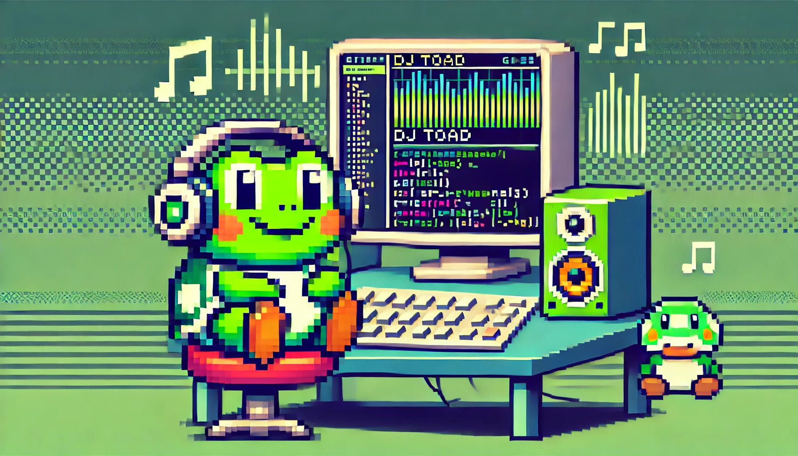

# DJ Toad 🎧🐸



DJ Toad es un bot de Discord diseñado para reproducir música en tu servidor. Permite a los usuarios buscar canciones, añadirlas a la cola de reproducción y controlarla con comandos sencillos.

## Índice

1. [Características](#características)
2. [Comandos disponibles](#comandos-disponibles)
3. [Requisitos](#requisitos)
4. [Instalación](#instalación)
5. [Configuración del bot en Discord](#configuración-del-bot-en-discord)
6. [Uso](#uso)
7. [Notas importantes](#notas-importantes)
8. [Contribuciones](#contribuciones)
9. [Autor](#autor)
10. [Licencia](#licencia)

## Características

- **Reproducción de música**: Busca y reproduce canciones desde YouTube Music.
- **Cola de reproducción**: Gestiona una cola de canciones, permite añadir nuevas canciones al inicio o al final.
- **Control de reproducción**: Pausa, reanuda, salta canciones y detiene la reproducción.
- **Recomendaciones automáticas**: Añade automáticamente canciones recomendadas a la cola.

## Comandos disponibles

- `!play [canción/artista]`: Busca y reproduce una canción en tu canal de voz.
- `!add [canción/artista]`: Añade una canción al inicio de la cola de reproducción.
- `!list`: Muestra las canciones en la cola de reproducción.
- `!next`: Salta a la siguiente canción en la cola.
- `!pause`: Pausa la canción en reproducción.
- `!resume`: Reanuda la canción pausada.
- `!stop`: Detiene la música y desconecta al bot.
- `!dance1`, `!dance2`: Saca a Toad a bailar!

## Requisitos

- Python 3.8 o superior.
- FFmpeg instalado y configurado en las variables de entorno del sistema.
- Una cuenta de Discord y un servidor donde tengas permisos para añadir bots.

## Instalación

1. Clona el repositorio:

   ```bash
   git clone https://github.com/kzon94/djtoad.git
   cd djtoad
   ```

2. Crea un entorno virtual (opcional pero recomendado):

   ```bash
   python -m venv venv
   source venv/bin/activate   # En Windows: venv\Scripts\activate
   ```

3. Instala las dependencias:

   ```bash
   pip install -r requirements.txt
   ```

4. Configura las variables de entorno:
   - Crea un archivo `.env` en la raíz del proyecto.
   - Añade tu token de Discord al archivo `.env`:
     
     ```env
     DISCORD_TOKEN=tu_token_de_discord
     ```

5. Ejecuta el bot:

   ```bash
   python djtoad.py
   ```

## Configuración del bot en Discord

1. Crea una aplicación y un bot en el [Portal de Desarrolladores de Discord](https://discord.com/developers/applications).
2. Obtén el token del bot y añádelo al archivo `.env` como se indicó anteriormente.
3. Invita al bot a tu servidor usando el enlace de autorización con los permisos necesarios:
   - En "OAuth2" > "URL Generator":
   - En **Scopes**, selecciona `bot`.
   - En **Bot Permissions**, selecciona:
     - Read Messages/View Channels
     - Send Messages
     - Connect
     - Speak
   - Copia y pega el enlace generado en tu navegador para invitar al bot.

## Uso

1. Únete a un canal de voz en tu servidor de Discord.
2. En un canal de texto, utiliza los comandos para interactuar con el bot.
3. Disfruta de la música y gestiona la reproducción a tu gusto.

## Notas importantes

- **Seguridad**: Nunca compartas tu token de Discord. El archivo `.env` está incluido en `.gitignore` para evitar que se suba al repositorio.
- **FFmpeg**: Asegúrate de que FFmpeg está instalado y configurado correctamente. Puedes descargarlo desde [ffmpeg.org](https://ffmpeg.org/).

## Contribuciones

Las contribuciones son bienvenidas. Si deseas mejorar el bot, por favor, abre un `issue` o envía un `pull request`.

## Autor

- **Nombre**: Victor Belinchón
- **Contacto**: vbelinchonperez@gmail.com

## Licencia

Este proyecto está bajo la Licencia MIT. Consulta el archivo `LICENSE` para más información.


